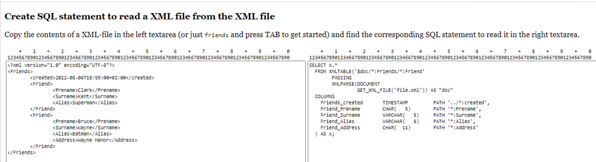
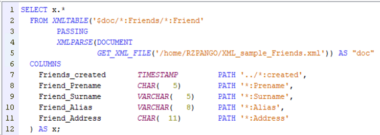
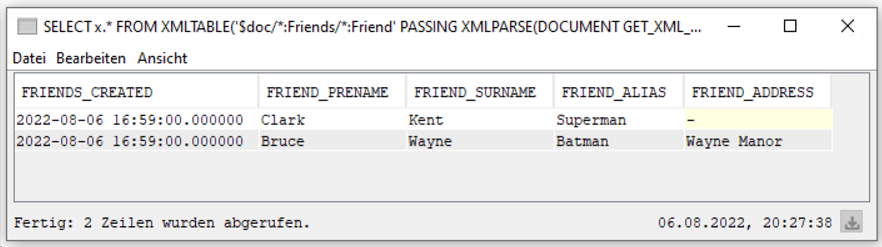

# SQLRPGLE_Tools
These HTML pages contain JavaScript and are intended to make life for the RPGLE programmer easier.

## XML_to_XMLTABLE.html
SQL provides a powerful function XMLTABLE to read XML documents as if they were ordinary table rows (or database records).
However, the coding is a cumbersome and errorprone activity, at least in my not so humble opinion.
So the JavaScript on this page tries to find the repeating element and generates a SQL statement that can be almost immediately used in ACS to read the XML file.

## how to use
- open the page https://ag1965.github.io/SQLRPGLE_Tools/XML_to_XMLTABLE.html in your browser
or copy the repository to your machine with
```
git clone https://ag1965.github.com/SQLRPGLE_Tools
```


- Copy a XML document into the left textarea, leave the field and find the generated SQL in the right textarea.
- Correct the length of the fields to the maximum length you expect (if you have a XML schema, you might be able to retrieve the info from there)
- use it in an SQLRPGLE program (there is a tool that converts the SQL statement to a data structure definition, in which you can fetch the rows).

Keep in mind that the generated SQL can only be as good as the XML file you provide.

## Sample
- Enter "friends" in the left textarea, leave it (by e.g. pressing the TAB-key) and in the right textarea the SQL needed to read the XML should appear.

- Copy the contents of the left textarea and save it as e.g. friends.xml in the IFS.
- Copy the contents of the right textarea and paste it in a "Run SQL Scripts" window of ACS. Be sure to have a COMMIT connection, as SQL function GET_XML_FILE requires this.
- Change the filename "file.xml" to the friends.xml file.

- Run the XML statement, you should receive a result set!

### more sophisticated samples
the magic words "pain.001", "pacs.003" and "pacs.008" insert more sophisticated samples from the financial sector.

### known weaknesses
- [ ] for this proof of concept namespaces are mostly ignored; by using the "any"-approach it works with most of the files anyways
- [ ] White space leads to errors. Please remove unnecessary blanks, tabulators and carriage return / line feed characters.
- [ ] generated column names are not necessarily unique. E.g. /Creditor/Id/BIC and /Debitor/Id/BIC both lead to the same column name Id_BIC.
- [ ] repeating elements at the end of the tree. E.g. 
```
<PstlAdr><AdrLine>Nowhere Street</AdrLine><AdrLine>4711 In Vain</AdrLine></PstlAdr> 
```
generates just one line:
```
 AdrLine   VARCHAR(80)  PATH('PstlAdr/AdrLine')
```
It should be 
```
 AdrLine1  VARCHAR(80)  PATH('PstlAdr/AdrLine[1]')
 AdrLine2  VARCHAR(80)  PATH('PstlAdr/AdrLine[2]')
```
 